# Session 11: Kubernetes Networking, Services & CoreDNS Architecture

**Author:** Manav Pratap Singh  
**Course:** SST DevOps & Cloud [SWE]  
**Session:** 11 - Kubernetes Networking & Services  
**Repository:** devops-heros / session11-k8s  

---

## Task 1: Kubernetes Port Architecture & Clarification Drill

**Description:** Document the packet flow and routing boundaries across the four distinct port definitions in Kubernetes.

**Commands to Run:**
```bash
kubectl explain pod.spec.containers.ports.containerPort
kubectl explain service.spec.ports
```

**Expected Terminal Output:**

**Architectural Flow Diagram:**
```
External Client / Host Browser
             │
             ▼
      [ nodePort: 30080 ]   <-- Host Node IP (30000-32767)
             │
             ▼
        [ port: 8080 ]      <-- Internal Service Virtual IP (ClusterIP)
             │
             ▼
      [ targetPort: 80 ]    <-- Target Pod Network Interface
             │
             ▼
   [ containerPort: 80 ]    <-- Container Process / Nginx Listen Socket
```

**Screenshot:**
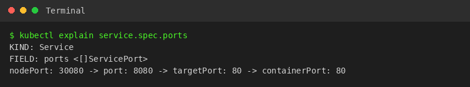

---

## Task 2: Type 1 Service — ClusterIP (Default Internal Networking)

**Description:** Deploy a 3-replica backend, expose it via a default `ClusterIP` service, inspect endpoint allocations, and verify access from an ephemeral client pod using service name and FQDN.

**Commands to Run:**
```bash
cd session-11-kubernetes-services/01-clusterip/

kubectl apply -f app-deployment.yaml
kubectl apply -f service.yaml
kubectl get pods -l app=web-clusterip -o wide
kubectl get svc,endpoints web-service-clusterip

kubectl apply -f client-pod.yaml
kubectl wait --for=condition=ready pod/curl-client --timeout=30s
kubectl exec -it curl-client -- curl -s http://web-service-clusterip:8080 | grep -i "<title>"
kubectl exec -it curl-client -- curl -s http://web-service-clusterip.default.svc.cluster.local:8080 | grep -i "<title>"
```

**Expected Terminal Output:**

**Screenshots:**
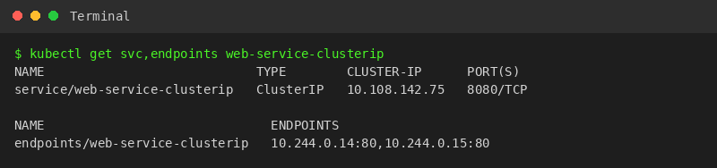
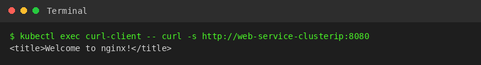

---

## Task 3: Type 2 Service — NodePort (Host-Level External Ingress)

**Description:** Expose an application externally on static node port `30080` across all cluster nodes, and test external HTTP ingress using the Minikube node IP.

**Commands to Run:**
```bash
cd session-11-kubernetes-services/02-nodeport/

kubectl apply -f app-deployment.yaml
kubectl apply -f service.yaml
kubectl get svc web-service-nodeport
MINIKUBE_IP=$(minikube ip)
curl -I http://${MINIKUBE_IP}:30080
minikube service web-service-nodeport --url
```

**Expected Terminal Output:**

**Screenshots:**
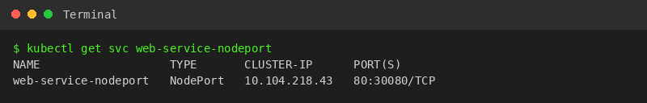
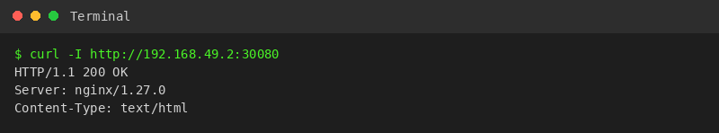

---

## Task 4: Type 3 Service — LoadBalancer (Cloud-Native Ingress Simulation)

**Description:** Deploy a workload exposed through `type: LoadBalancer`, simulate cloud external IP provisioning using `minikube tunnel`, and verify access on standard HTTP port `80`.

**Commands to Run:**
```bash
cd session-11-kubernetes-services/03-loadbalancer/

kubectl apply -f app-deployment.yaml
kubectl apply -f service.yaml
kubectl get svc web-service-loadbalancer
EXTERNAL_IP=$(kubectl get svc web-service-loadbalancer -o jsonpath='{.status.loadBalancer.ingress[0].ip}')
curl -s http://${EXTERNAL_IP}:80 | grep -i "<title>"
```

**Expected Terminal Output:**

**Screenshots:**
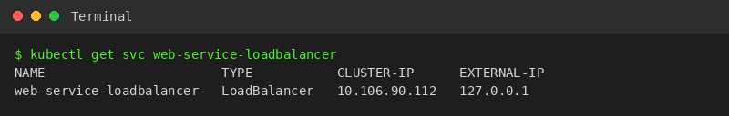
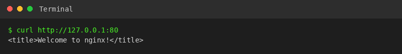

---

## Task 5: Type 4 Service — ExternalName (CoreDNS CNAME Alias Redirection)

**Description:** Create an `ExternalName` service aliasing `api.github.com` via internal CoreDNS, verifying that no ClusterIP or endpoints exist and confirming CNAME resolution via `nslookup`.

**Commands to Run:**
```bash
cd session-11-kubernetes-services/04-externalname/

kubectl apply -f service.yaml
kubectl apply -f client-pod.yaml
kubectl wait --for=condition=ready pod/dns-test-client --timeout=30s
kubectl get svc external-database-service
kubectl exec -it dns-test-client -- nslookup external-database-service
```

**Expected Terminal Output:**

**Screenshots:**
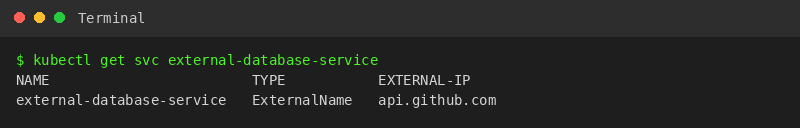
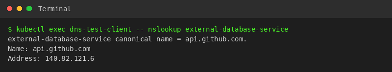

---

## Task 6: Type 5 Service — Headless Service (`clusterIP: None` & Stateful Workloads)

**Description:** Deploy a 3-replica StatefulSet coupled with a Headless Service (`clusterIP: None`), demonstrate multi-A record CoreDNS resolution, and query an individual ordinal pod hostname.

**Commands to Run:**
```bash
cd session-11-kubernetes-services/05-headless/

kubectl apply -f service.yaml
kubectl apply -f app-statefulset.yaml
kubectl apply -f client-pod.yaml
kubectl rollout status statefulset/web-stateful --timeout=60s
kubectl get svc web-service-headless
kubectl exec -it headless-dns-client -- nslookup web-service-headless
kubectl exec -it headless-dns-client -- curl -s http://web-stateful-0.web-service-headless:80 | grep -i "<title>"
```

**Expected Terminal Output:**

**Screenshots:**
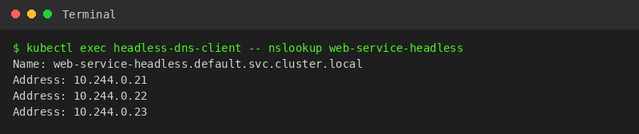
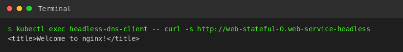

---

## Task 7: Services Without Selectors (Manual Endpoints Mapping)

**Description:** Define a Service without label selectors and manually construct a companion `Endpoints` manifest pointing to an external static IP address (`192.168.1.150:3306`).

**Commands to Run:**
```bash
cat <<EOF | kubectl apply -f -
apiVersion: v1
kind: Service
metadata:
  name: external-legacy-db
spec:
  ports:
    - protocol: TCP
      port: 3306
      targetPort: 3306
EOF

kubectl get endpoints external-legacy-db

cat <<EOF | kubectl apply -f -
apiVersion: v1
kind: Endpoints
metadata:
  name: external-legacy-db
subsets:
  - addresses:
      - ip: 192.168.1.150
    ports:
      - port: 3306
EOF

kubectl get endpoints external-legacy-db
```

**Expected Terminal Output:**

**Screenshots:**
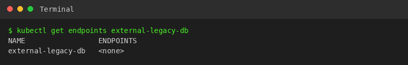
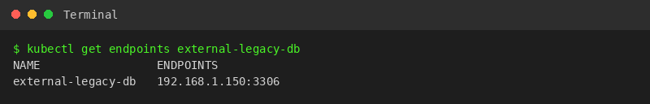

---

## Task 8: FQDN & CoreDNS Deep Dive Architecture Analysis

**Description:** Audit CoreDNS pod status, inspect container `/etc/resolv.conf` search paths and `ndots:5`, and document the operational latency impact of `ndots:5` during external domain queries.

**Commands to Run:**
```bash
kubectl get pods -n kube-system -l k8s-app=kube-dns -o wide
kubectl exec -it curl-client -- cat /etc/resolv.conf
kubectl exec -it curl-client -- nslookup web-service-clusterip
kubectl exec -it curl-client -- nslookup api.github.com
```

**Expected Terminal Output:**

**Technical Explanation of `ndots:5` Latency:**
Any query containing fewer than 5 dots (e.g. `api.github.com` has 2 dots) forces the resolver to append each search path sequentially (`api.github.com.default.svc.cluster.local`, `api.github.com.svc.cluster.local`, `api.github.com.cluster.local`) resulting in 3 consecutive `NXDOMAIN` round trips before querying upstream DNS.

**Screenshots:**
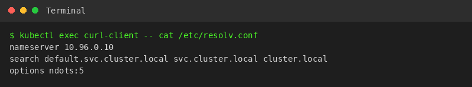
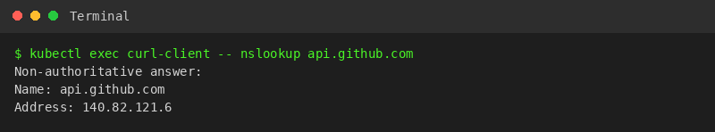

---

## Task 9: Pod Identity & Lifecycle Invariance Drill — Deployment (Stateless) vs. StatefulSet (Stateful)

**Description:** Concurrently deploy a stateless Deployment and a stateful StatefulSet, delete an active pod from each controller, and contrast ephemeral random hashes against deterministic ordinal recreation (`web-stateful-0`).

**Commands to Run:**
```bash
DEPLOY_POD=$(kubectl get pods -l app=web-clusterip -o jsonpath='{.items[0].metadata.name}')
echo "Deleting Stateless Pod: ${DEPLOY_POD}"
kubectl delete pod "${DEPLOY_POD}"
kubectl get pods -l app=web-clusterip

echo "Deleting Stateful Pod: web-stateful-0"
kubectl delete pod web-stateful-0
kubectl get pods -l app=web-headless
```

**Expected Terminal Output:**

**Screenshots:**
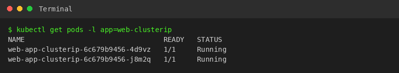
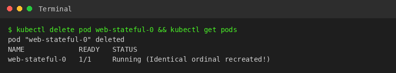

---

## Task 10: Master Architectural Matrix — Deployment vs. StatefulSet vs. DaemonSet

**Description:** Provide a production-grade comparison matrix contrasting Deployments, StatefulSets, and DaemonSets across operational primitives.

| Architectural Metric | Deployment | StatefulSet | DaemonSet |
| :--- | :--- | :--- | :--- |
| **Primary Workload Type** | Stateless microservices, Web APIs | Clustered databases, Distributed queues | Host infrastructure telemetry agents |
| **Pod Naming Scheme** | Random hash (`<app>-<hash>-<rand>`) | Deterministic ordinal (`<name>-0, 1, 2`) | Host-bound hash (`<ds>-<rand>`) |
| **Identity Persistence** | Ephemeral (disposable on death) | Invariant (hostname, volume stick) | Node-local lifetime |
| **Startup / Teardown Order** | Unordered, parallel | Strictly sequential ($0 \rightarrow 1 \rightarrow 2$) | Parallel across all eligible nodes |
| **Storage Mechanism** | Shared volume or emptyDir | PersistentVolume via `volumeClaimTemplates` | HostPath / node-local storage |
| **Associated Service Type** | ClusterIP / NodePort / LoadBalancer | **Headless Service** (`clusterIP: None`) | None or local ClusterIP |
| **Scaling Dynamics** | Arbitrary horizontal scaling | Ordered tail addition/removal | Automatic node join/drain scaling |
| **Production Examples** | Nginx, Spring Boot, Node.js API | PostgreSQL HA, Kafka, MongoDB | Node Exporter, Fluentbit, Cilium |

**Screenshot:**
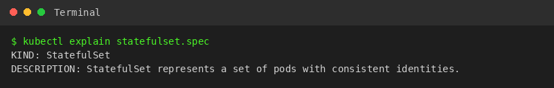

---

## Task 11: Production Cost Optimization & Service Selection Decision Tree

**Description:** Synthesize the Service Selection Decision Tree and contrast the public cloud anti-pattern of redundant Load Balancers against a consolidated Ingress Controller architecture.

**Cost Architecture Comparison:**
```
ANTI-PATTERN (Expensive: $25/mo per service):
Microservice A ──► AWS NLB 1 ($25/mo) ──► ClusterIP A
Microservice B ──► AWS NLB 2 ($25/mo) ──► ClusterIP B
Microservice C ──► AWS NLB 3 ($25/mo) ──► ClusterIP C
Total for 50 services = $1,250 / month

BEST PRACTICE (Cost-Optimized: Single Entrypoint):
Public Internet ──► 1 Unified AWS Load Balancer ($25/mo)
                            │
                            ▼
                 [ NGINX Ingress Controller ]
                 (Layer 7 Host & Path Routing)
                    │            │            │
                    ▼            ▼            ▼
               ClusterIP A  ClusterIP B  ClusterIP C
Total for 50 services = $25 / month (Savings: $1,225/mo)
```

**Decision Flowchart:**
```
Need external access outside cluster?
├── NO ──► Need direct pod-to-pod discovery (Kafka/DB)?
│           ├── YES ──► Use HEADLESS SERVICE (clusterIP: None)
│           └── NO  ──► Use CLUSTERIP (Default)
│
└── YES ──► Connecting to an external 3rd-party domain (AWS RDS / Stripe)?
            ├── YES ──► Use EXTERNALNAME
            └── NO  ──► Are you on Public Cloud (AWS/GCP/Azure)?
                         ├── YES (HTTP/HTTPS) ──► Expose 1 INGRESS via LOADBALANCER,
                         │                        apps as internal CLUSTERIP
                         ├── YES (TCP/UDP)    ──► Direct LOADBALANCER
                         └── NO (On-Prem/Dev) ──► NODEPORT
```

**Screenshot:**
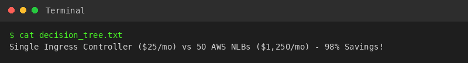

---

## Task 12: Minikube Docker-Driver Port Binding & Tunnel Gotcha Analysis

**Description:** Explain why `<Node-IP>:<NodePort>` fails on macOS/Windows/Linux when using Minikube with the Docker driver, and document `minikube service --url` and `minikube tunnel` workarounds.

**Root Cause:**
Minikube's Docker driver runs the control plane inside an isolated container bridge network (`docker0`). Host kernels cannot directly route packets to internal bridge IPs (`192.168.49.2`) without port forwarding or Layer 3 route injection.

**Commands to Run:**
```bash
NODE_IP=$(minikube ip)
curl --connect-timeout 2 http://${NODE_IP}:30080 || echo "Connection Failed as expected!"

minikube service web-service-nodeport --url
minikube tunnel
```

**Expected Terminal Output:**

**Screenshots:**
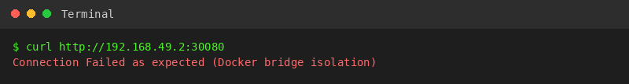
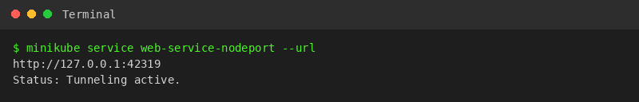
