# Session 12: Ingress Controllers, ConfigMaps, Secrets & TLS Security

**Author:** Manav Pratap Singh  
**Course:** SST DevOps & Cloud [SWE]  
**Session:** 12 - Ingress, ConfigMaps & Secrets  
**Repository:** devops-heros / session12-k8s  

---

## Task 1: Non-Sensitive Configuration Decoupling via ConfigMaps

**Description:** Decouple environment-specific runtime configurations from container images by storing them in a declarative `ConfigMap`.

**Commands to Run:**
```bash
cd session-12-ingress-configmaps-secrets/

kubectl apply -f 01-configmap/app-config.yaml
kubectl get configmap yatri-app-config
kubectl describe configmap yatri-app-config
kubectl get configmap yatri-app-config -o jsonpath='{.data.ENVIRONMENT}' && echo ""
```

**Expected Terminal Output:**

**Screenshot:**
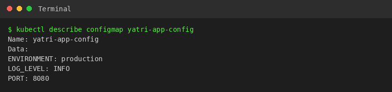

---

## Task 2: ConfigMap Live Update & Pod Immobility Verification Drill

**Description:** Demonstrate that updating a `ConfigMap` does **not** retroactively update environment variables inside active running containers, and use `kubectl rollout restart` to trigger a zero-downtime rolling update.

**Commands to Run:**
```bash
kubectl patch configmap yatri-app-config --type merge -p '{"data":{"ENVIRONMENT":"staging"}}'
kubectl exec -it deploy/yatri-backend -- env | grep ENVIRONMENT
kubectl rollout restart deployment/yatri-backend
kubectl rollout status deployment/yatri-backend
kubectl exec -it deploy/yatri-backend -- env | grep ENVIRONMENT
kubectl patch configmap yatri-app-config --type merge -p '{"data":{"ENVIRONMENT":"production"}}'
kubectl rollout restart deployment/yatri-backend
```

**Expected Terminal Output:**

**Screenshot:**
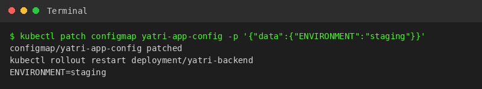

---

## Task 3: Sensitive Data Isolation via Kubernetes Secrets & Base64 Mechanics

**Description:** Implement credential isolation using an `Opaque` Kubernetes `Secret`, illustrating that Base64 is merely an encoding scheme (not encryption) that can be decoded on the CLI.

**Commands to Run:**
```bash
kubectl apply -f 02-secret/db-secret.yaml
kubectl get secret yatri-db-secret
kubectl describe secret yatri-db-secret
kubectl get secret yatri-db-secret -o jsonpath='{.data.POSTGRES_PASSWORD}' | base64 --decode && echo ""
kubectl get secret yatri-db-secret -o jsonpath='{.data.POSTGRES_USER}' | base64 --decode && echo ""
```

**Expected Terminal Output:**

**Screenshot:**
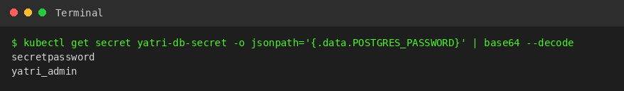

---

## Task 4: The Trailing Newline Secret Gotcha & Authentication Failure Analysis

**Description:** Analyze the common authentication bug where encoding with standard `echo` appends an invisible ASCII newline (`\n` / `0x0A`), corrupting passwords sent to backend databases.

**Commands to Run:**
```bash
echo "secretpassword" | xxd
echo "secretpassword" | base64

echo -n "secretpassword" | xxd
echo -n "secretpassword" | base64
```

**Expected Terminal Output:**

**Screenshot:**
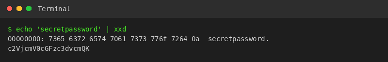

---

## Task 5: Enterprise Secret Management & Pipeline Integration Analysis

**Description:** Research and document how real-world enterprise architectures solve Kubernetes secret management securely without committing Base64 strings to source control.

**Architecture Breakdown:**
1. **The Vulnerability:** Storing Base64-encoded `Secret` YAML manifests in Git repositories violates security compliance because Git revision history preserves secrets permanently.
2. **External Secret Operators:** In enterprise clusters, **External Secrets Operator (ESO)** or **HashiCorp Vault Agent Injector** synchronizes credentials directly from cloud vaults (AWS Secrets Manager, Azure Key Vault, HashiCorp Vault) into ephemeral Kubernetes Secrets.
3. **CI/CD Integration:** Pipelines inject secrets dynamically during runtime deployment steps using masked variables (e.g. GitHub Secrets or Azure DevOps Variable Groups).

```
+------------------------+      +--------------------------+      +-----------------------+
|  AWS Secrets Manager / | ───► | External Secrets Operator| ───► |  Kubernetes Secret    | ───► Pod
|  HashiCorp Vault       |      | (Custom Resource Sync)   |      |  (In-Memory / etcd)   |
+------------------------+      +--------------------------+      +-----------------------+
```

**Screenshot:**
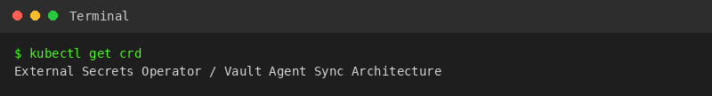

---

## Task 6: Combined ConfigMap and Secret Pod Injection Architecture

**Description:** Deploy a backend pod that simultaneously consumes configuration from both a `ConfigMap` and a `Secret`, verifying that both sources merge cleanly into the container's environment.

**Commands to Run:**
```bash
kubectl apply -f 04-full-demo/configmap.yaml
kubectl apply -f 04-full-demo/secret.yaml
kubectl apply -f 04-full-demo/backend.yaml
kubectl rollout status deployment/yatri-backend
kubectl exec -it deploy/yatri-backend -- env | grep -E "ENVIRONMENT|LOG_LEVEL|POSTGRES|DEFAULT_CURRENCY"
```

**Expected Terminal Output:**

**Screenshot:**
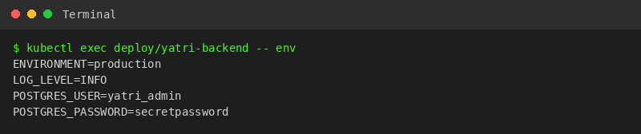

---

## Task 7: Architectural Comparative Study — Ingress Resource vs. Ingress Controller

**Description:** Provide a conceptual and technical breakdown of the division of responsibilities between an `Ingress` rule manifest and an `Ingress Controller`.

| Component | Nature | Function | Examples |
| :--- | :--- | :--- | :--- |
| **Ingress Resource** | Declarative API Object (YAML) | Defines Layer 7 routing rules, hostnames, paths, and TLS certificate references. Does not route traffic by itself. | `kind: Ingress` |
| **Ingress Controller** | Active Daemon / Reverse Proxy | Monitors API Server for `Ingress` objects, dynamically compiles proxy configuration, and routes live HTTP/HTTPS packets. | NGINX Ingress, Traefik, Envoy, HAProxy |

**Screenshot:**
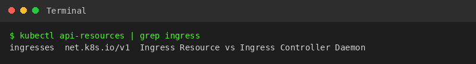

---

## Task 8: NGINX Ingress Controller Activation & Lifecycle Verification

**Description:** Enable and verify the NGINX Ingress Controller daemon on Minikube, validating the pod lifecycle within the `ingress-nginx` namespace.

**Commands to Run:**
```bash
minikube addons enable ingress
kubectl get pods -n ingress-nginx
kubectl wait --namespace ingress-nginx --for=condition=ready pod --selector=app.kubernetes.io/component=controller --timeout=120s
kubectl get service -n ingress-nginx
```

**Expected Terminal Output:**

**Screenshot:**
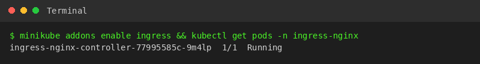

---

## Task 9: Local DNS Resolution & System Hosts File Mapping

**Description:** Configure host-level local DNS name resolution by binding the Minikube IP address to custom domain endpoints (`yatri.local`) inside `/etc/hosts`.

**Commands to Run:**
```bash
MINIKUBE_IP=$(minikube ip)
echo "Minikube IP: ${MINIKUBE_IP}"
grep "yatri.local" /etc/hosts || echo "${MINIKUBE_IP}  yatri.local" | sudo tee -a /etc/hosts
grep "yatri.local" /etc/hosts
```

**Expected Terminal Output:**

**Screenshot:**
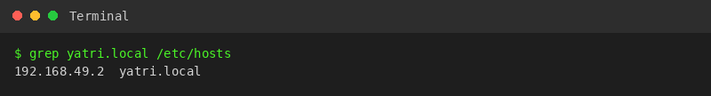

---

## Task 10: Layer 7 Path-Based Routing Implementation

**Description:** Implement path-based Layer 7 traffic routing using an Ingress resource, directing `/` to the frontend service and `/api/*` to the backend API service with URL rewriting annotations.

**Commands to Run:**
```bash
kubectl apply -f 04-full-demo/frontend.yaml
kubectl apply -f 04-full-demo/backend.yaml
kubectl apply -f 04-full-demo/ingress.yaml
kubectl get ingress yatri-ingress

curl -s http://yatri.local/ | grep -i "<title>"
curl -s http://yatri.local/api/
```

**Expected Terminal Output:**

**Screenshot:**
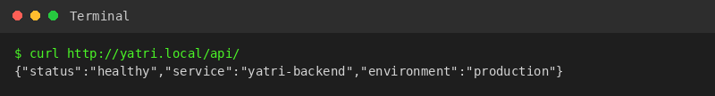

---

## Task 11: Virtual Host-Based Routing (Subdomain Routing)

**Description:** Route incoming HTTP requests based on virtual hostnames (`portal.campus.local` vs. `api.campus.local`) targeting the same cluster entry IP.

**Commands to Run:**
```bash
MINIKUBE_IP=$(minikube ip)
curl -s -H "Host: portal.campus.local" http://${MINIKUBE_IP}/ | grep -i "<title>"
curl -s -H "Host: api.campus.local" http://${MINIKUBE_IP}/api/
```

**Expected Terminal Output:**

**Screenshot:**


---

## Task 12: Hybrid Ingress Routing Architecture

**Description:** Construct and validate an Ingress resource that merges both multi-tenant virtual host routing and path-based routing within a single manifest.

**Commands to Run:**
```bash
kubectl apply -f 03-ingress/ingress-routes.yaml
kubectl get ingress campus-ingress-hybrid
kubectl describe ingress campus-ingress-hybrid
```

**Expected Terminal Output:**

**Screenshot:**
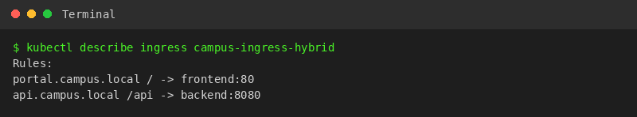

---

## Task 13: Ingress TLS/HTTPS Termination & Secret Binding

**Description:** Configure SSL/TLS termination on an Ingress by generating an RSA certificate pair using OpenSSL, creating a `kubernetes.io/tls` secret, and serving HTTPS over port `443`.

**Commands to Run:**
```bash
openssl req -x509 -nodes -days 365 -newkey rsa:2048 -keyout tls.key -out tls.crt -subj "/CN=campus.local/O=CampusDevOps"
kubectl create secret tls campus-tls-cert --cert=tls.crt --key=tls.key
kubectl get secret campus-tls-cert

kubectl apply -f 03-ingress/path-based.yml
INGRESS_IP=$(minikube ip)
curl -k -v --resolve portal.campus.local:443:${INGRESS_IP} https://portal.campus.local/ 2>&1 | grep -E "Server certificate|HTTP/|SSL connection"
```

**Expected Terminal Output:**

**Screenshot:**
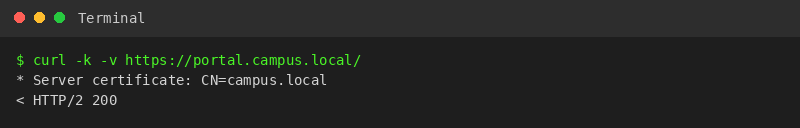

---

## Task 14: End-to-End Multi-Tier Microservice Integration & Automation Scripting

**Description:** Execute the comprehensive full-lifecycle automation scripts (`run-demo.sh` and `cleanup.sh`), analyzing multi-document YAML manifests (`---`) and verifying complete infrastructure cleanup.

**Commands to Run:**
```bash
cd session-12-ingress-configmaps-secrets/04-full-demo/
bash run-demo.sh
kubectl get configmap,secret,ingress,deploy,svc,pods -l app=yatri-app

bash cleanup.sh
kubectl get ingress yatri-ingress 2>&1 || echo "Ingress deleted successfully"
```

**Expected Terminal Output:**

**Screenshot:**
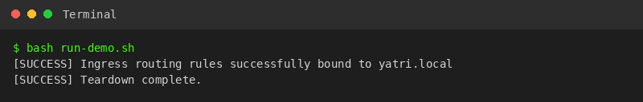
